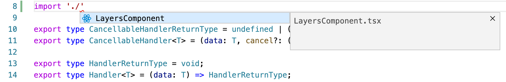
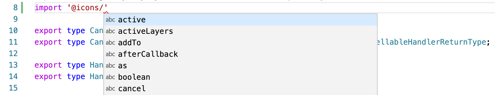
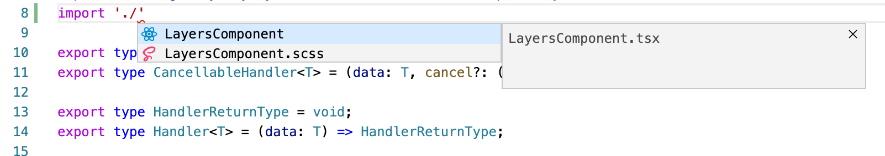
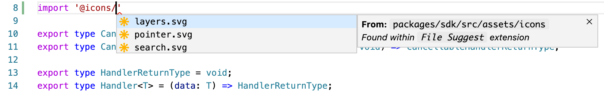

# VS Code file suggest extension

## About

This extension will help when developing in the TypeScript language. By default, VS Code does not support import hints for paths to files with extensions other than JavaScript or Typescript. This extension will fix this problem.

## Features

- relative paths supported
- absolute paths supported
- alias paths supported (`paths` property from `tsconfig.json`)
- `node_modules` paths supported
- zero-configuration

## Installation

Install extension from [Visual Studio Marketplace](https://marketplace.visualstudio.com/items?itemName=mishannn.vscode-file-suggest).

## Screenshots

### Before installing

### After installing

